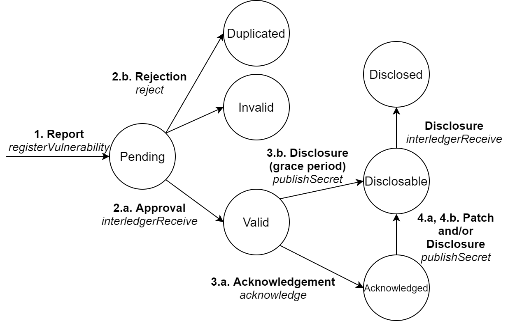

# Public smart contracts of ARD

## Overview 
The smart contracts store records of IT vulnerabilities. A state machine identifies the state of progress of a particular vulnerability, from its creation to its resolution. This provides a transparent, immutable and decentralized support to the responsible disclosure process.

The actors in our scenario are:
- The Expert, who discovers and stores a new vulnerability record
- The Authority, who accepts, or refuses, a vulnerability record
- The Vendor, the organization suffering of the vulnerability

The Authority smart contract, *AuthorityContract.sol*, is in charge of registering (and unregistering) a Vendor to the ARD process by creating a Vendor smart contract, *VendorContract*,  creating a new vulnerability record, approving, and disclosing the vulnerability.
The Vendor smart contract is in charge of registering (and unregistering) products, storing internally the vulnerability data records concerning its products and acknowledging the vulnerability. The Vendor also funds the smart contract with Ether to assign as a bounty to the Expert. The figure below shows the composition. 

## The states of a vulnerability

Each circle represents the State of a single vulnerability. The Vendor smart contract stores such information. For each transition, in **bold** is shown the high level event, in *italic* the corresponding smart contract function.
An Expert uploads to the Authority smart contract a bundle consisting of {vendorAddres, productId, hashlock, vulnerabilityHash}, and the contract pushes a new vulnerability record into the Vendor contract. A vulnerability is approved (or not) by the Authority, which sets the timelock. The Vendor may acknowledge and provide a patch for the vulnerability within the timelock. The condition to disclose a vulnerability V is the following:

- (V.State == Valid AND V.AckTimelock.Expired)
- OR
- (V.State == Acknowledged AND V.Timelock.Expired)
- OR
- (Vendor notifies a patch)

The disclosure consists of two phases: publishing the secret (Disclosable), and fully disclose the vulnerability data (Disclosed). The Auhtority contract exposes the functions to disclose. The Vendor smart contract stores a reward for the Expert that can be collected by them at any moment after the secret has been published (V.State == Disclosable). The reward amount is set by the Vendor at *acknowledge*.

## Structure of the folders

The folder is structured as a [Truffle](https://www.trufflesuite.com/) project. 
During the development phase we are evaluating different architectures of smart contracts. Both the **contracts/** and **test/** folders keep a sub-folder for each proposed architecture. Currently we have:
- *singleContract/*: In this design the system is composed by a single smart contract keeping a reference to each vulnerability. A vulnerability is a *struct*;
- *contractPerVulnerability/*: In this design the system is composed by a factory contract creating a smart contract for each vulnerability. A smart contract for a Vendor is also provided to manage the bounties;
- **(current)** *contractPerVendor/*: In this design we have a factory contract creating a smart contract for each Vendor. Each Vendor contract manages the bouties and stores, as *structs*, the vulnerability records opened to that particular Vendor. The Authority owns two contracts: the VendorFactory, a factory of VendorContracts, and the AuthorityContract for the ARD process. The factory is needed to avoid a bytecode too large for the AuhtorityContract to be deployable.

## The flow of the smart contract functions

Thee figures below show the sequence of calls of the smart contract functions. An UML "Actor" represents an Ethereum Externally Owned Account (EOA); a rectangle a smart contract.
The *transfer_ownership* activates the factory. This extra step is required since we have a race condition where the VendorFactory needs to know the address of the AuhtorityContract (its owner), and the AuhtorityContract needs to know the address of the Factory (to call its factory method).

The setup for the Authority requires the following steps:

****

The setup for the Vendor requires the creation of the related smart contract, done by the VendorFactory thorugh the AuthorityContract, and the creation of at least one product: the VendorContract produces a uninque ID for the product. The Vendor should fund the contract with a plain transaction to pay for the bounties. The steps are the following:

******

The lifecycle of a vulnerability report is described by the following sequence diagram. The *publish_secret* function triggers the beginning of the disclosure procedure. In RED the functions that make the Authority contract compliant with Interledger.
The ARD flow is the following:

## Integration with SOFIE Interledger

The SOFIE Interledger component can be connected to an Ethereum application smart contract if this implements the interfaces provided by Interledger, namely:
- *InterledgerSenderInterface*, that is required if the smart contract wants to export data out. It exposes the event to emit called *InterledgerEventSending(uint id, bytes data)* where *id* is our vulnerability id *v_id*, and the functions *InterledgerCommit(id)* and *InterledgerAbort(id)* that are called in case of success, or failure, of the data with id *id*. *data* include the data to transfer encoded in bytes;
- *InterledgerReceiverInterface(uint nonce, bytes data)*, that is required by the couterpart to receive data. *nonce* is a parameter used by Interledger, and *bytes* is the received data. It exposes two events to notify if the receiving process ended well: *InterledgerEventAccepted(uint nonce)* in case of positive outcome, *InterledgerEventRejected(uint nonce)* otherwise. Both the events need to use as parameter the received nonce.

In this case, the Authority smart contract should export the secret as data to the ledger counterpart, and it needs to receive the vulnerability location in exchange. Therefore, the Authority implements both of the Interledger interfaces.

### Encoding and decoding the data

The function *publish_secret* encode the *data* to send in this way:

    TODO PUT HERE CODE

The fuction *InterledgerReceive* decodes the received *data* in this way:

    TODO PUT HERE CODE

## TODO

- [X] Write the tests for the smart contract
- [X] Update contract's documentation
- [x] Clean code
- [ ] Complete encoding/decoding examples
- [ ] Provide setup code examples
- [ ] Describe setup code examples
- [ ] Describe the requirements

## Requirements

NodeJs, Truffle

Install openzeppelin contracts with
    
    npm install