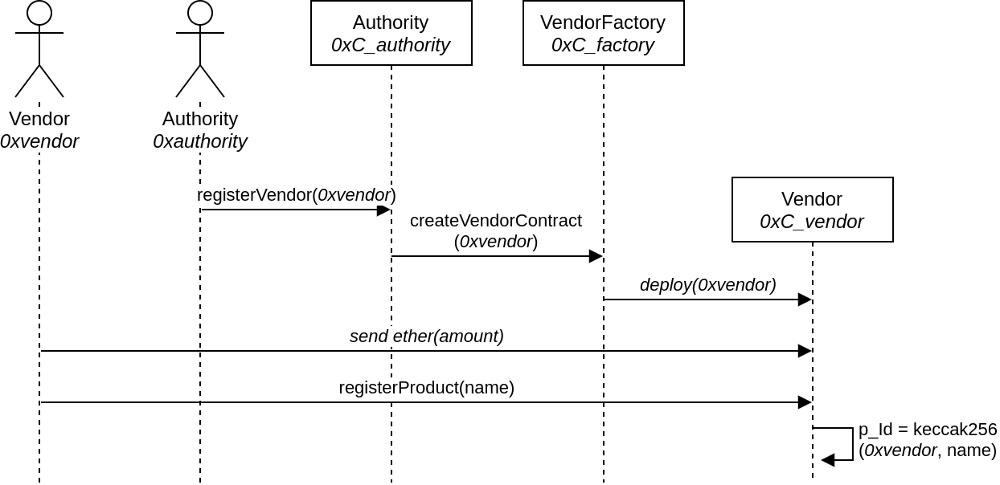

# Public smart contracts of ARD

## Table of Contents
- [Public smart contracts of ARD](#public-smart-contracts-of-ard)
  - [Table of Contents](#table-of-contents)
  - [Overview](#overview)
  - [The states of a vulnerability](#the-states-of-a-vulnerability)
  - [Structure of the folders](#structure-of-the-folders)
  - [Deploy the smart contract](#deploy-the-smart-contract)
  - [Integration with SOFIE Interledger](#integration-with-sofie-interledger)
    - [Sending data: interledgerEventSending](#sending-data-interledgereventsending)
    - [Receiving data sending: interledgerReceive](#receiving-data-sending-interledgerreceive)
  - [Testing](#testing)
  - [Setup the contracts to test Interledger](#setup-the-contracts-to-test-interledger)
  - [Requirements](#requirements)

## Overview 
The smart contracts store records of IT vulnerabilities. A state machine identifies the state of progress of a particular vulnerability, from its creation to its resolution. This provides a transparent, immutable and decentralized support to the responsible disclosure process.

The actors in our scenario are:
- The Expert, who discovers and stores a new vulnerability record
- The Authority, who accepts, or refuses, a vulnerability record
- The Vendor, the organization suffering of the vulnerability

The Authority smart contract, *AuthorityContract.sol*, is in charge of registering (and unregistering) a Vendor to the ARD process by creating a Vendor smart contract, *VendorContract*,  creating a new vulnerability record, approving, and disclosing the vulnerability.
The Vendor smart contract is in charge of registering (and unregistering) products, storing internally the vulnerability data records concerning its products and acknowledging the vulnerability. The Vendor also funds the smart contract with Ether to assign as a bounty to the Expert. The figure below shows the composition. 

## The states of a vulnerability

Each circle represents the State of a single vulnerability. The Vendor smart contract stores such information. For each transition, in **bold** is shown the high level event, in *italic* the corresponding smart contract function.
An Expert uploads to the Authority smart contract a bundle consisting of {vendorAddres, productId, hashlock, vulnerabilityHash}, and the contract pushes a new vulnerability record into the Vendor contract. A vulnerability is uniquely identified by its hash, the vulnerabilityHash input parameter, and its value will be used as key in the subsequent steps. A vulnerability is approved (or not) by the Authority, which sets the timelock. The Vendor may acknowledge and provide a patch for the vulnerability within the timelock. The condition to disclose a vulnerability V, together with the secret sent matching the hashlock, is the following:

- (V.State == Valid AND V.AckTimelock.Expired)
- OR
- (V.State == Acknowledged AND V.Timelock.Expired)
- OR
- (Vendor notifies a patch)

The disclosure consists of two phases: publishing the secret (Disclosable), and fully disclose the vulnerability data (Disclosed). The Auhtority contract exposes the functions to disclose. The Vendor smart contract stores a reward for the Expert that can be collected by them at any moment after the secret has been published (V.State == Disclosable). The reward amount is set by the Vendor with the *acknowledge* function.

## Structure of the folders

The folder is structured as a [Truffle](https://www.trufflesuite.com/) project. 
During the development phase we are evaluating different architectures of smart contracts. Both the **contracts/** and **test/** folders keep a sub-folder for each proposed architecture. Currently we have:
- **DEPRACATED** *singleContract/*: In this design the system is composed by a single smart contract keeping a reference to each vulnerability. A vulnerability is a *struct*;
- **DEPRACATED** *contractPerVulnerability/*: In this design the system is composed by a factory contract creating a smart contract for each vulnerability. A smart contract for a Vendor is also provided to manage the bounties;
- *contractPerVendor/*: In this design we have a factory contract creating a smart contract for each Vendor. Each Vendor contract manages the bouties and stores, as *structs*, the vulnerability records opened to that particular Vendor. The Authority owns two contracts: the VendorFactory, a factory of VendorContracts, and the AuthorityContract for the ARD process. The factory is needed to avoid a bytecode too large for the AuhtorityContract to be deployable.

## Deploy the smart contract

The figures below show the sequence of calls to deploy the smart contracts. An UML "Actor" represents an Ethereum Externally Owned Account (EOA); a rectangle a smart contract.
The *transfer_ownership* activates the factory. This extra step is required since we have a race condition where the VendorFactory needs to know the address of the AuhtorityContract (its owner), and the AuhtorityContract needs to know the address of the Factory (to call its factory method).

The deploy for the AuthorityContract requires the following steps:

****

A Vendor deploys a VendorContract calling a function to the AuthorityContract, which delegates the actual creation to the VendorFactory. A product can be created by the Vendor calling the VendorContract, which produces a uninque ID for the product. The Vendor should fund the contract with a plain transaction to pay for the bounties. The steps are the following:

## Integration with SOFIE Interledger

The AuthorityContract implements the interfaces *InterledgerSenderInterface* and *InterledgerReceiverInterface* to be compliant with SOFIE Interledger.
- *InterledgerSenderInterface*: the contract exposes the event *InterledgerEventSending(uint id, bytes data)* where *id* is the *vulnerabilityHash* (casted to unit) and *data* application specific data to send. This event is emitted by the *publishSecret* function to communicate the input secret to the other ledger;
- *InterledgerReceiverInterface*: the contract exposes the *interledgerReceive(uint nonce, bytes data)* function that is triggered in two moments: 1) to receive the approval of a vulnerability; 2) to receive the disclosure data.
- that is required by the couterpart to receive data. *nonce* is a parameter used by Interledger, and *bytes* is application specific data to receive.
  
### Sending data: interledgerEventSending

The function *publishSecret* needs to communicate to Interledger the received secret, if correct. The function encodes two parameters in *data*: the vulnerability id and the secret:

    bytes memory data = abi.encode(_vulnerabilityHash, _secret);
    emit InterledgerEventSending(_vulnerabilityHash, data);

### Receiving data sending: interledgerReceive

The fuction *interledgerReceive* function is called in two moments. When a vulnerability is approved, the function needs to know which vulnerability id has been approved. When a vulnerability is disclosed, the function needs to know which vulnerability id has been disclosed and the location, URL, containing the vulnerability. To discriminate the two phases, a third parameter, a flag, is used. The function decodes the received *data* in this way:

    (uint _vulnerabilityHash, uint _action, string memory _location) =  abi.decode(data, (uint, uint, string));

    if(_action==1) 
        _approve(_vulnerabilityHash);             // Execute code for the approval
    else if(_action==2)
        _disclose(_vulnerabilityHash, _location); // Execute code for the disclosure
    else
        revert("Invalid _action value: must be either 1 to approve a vulnerability, or 2 to discolse.");

    emit InterledgerEventAccepted(nonce);

## Testing

The tests of the smart contracts are in the `test/` folder.

## Setup the contracts to test Interledger

Follow the steps [described here](./migrations/README.md).

## Requirements

[NodeJs](https://nodejs.org/it/), [Truffle](https://www.trufflesuite.com/truffle)

Install [openzeppelin](https://github.com/OpenZeppelin/openzeppelin-contracts) contracts with
    
    npm install