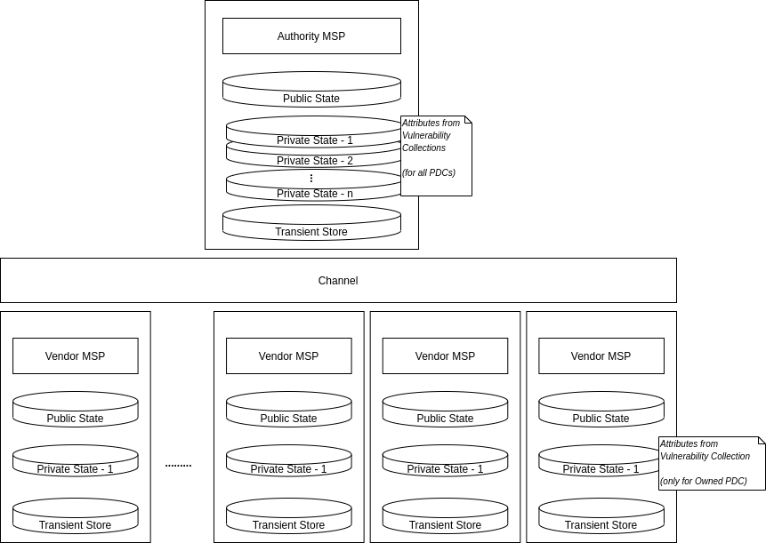
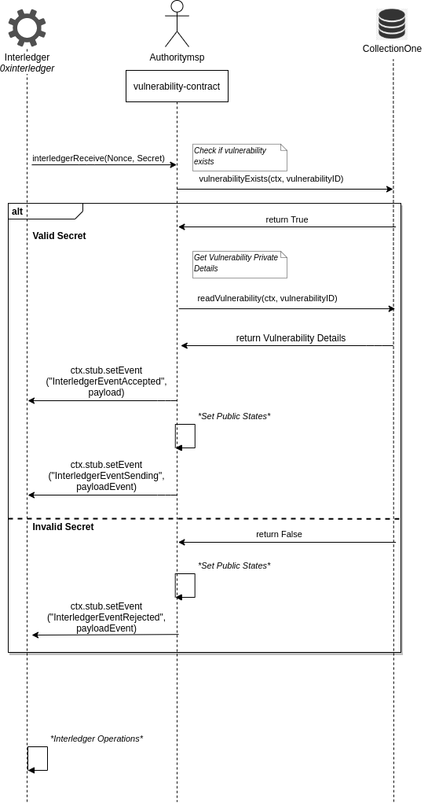

# Automated Responsible Disclosure Implementation
## Private Data Collections - Chaincode Development 

The Private Ledger for the Automated Responsible Disclosure Project is implemented using HyperLedger Fabric, exploiting the concept of Private Data Collections. 

For every Vendor registered with the ARD system, a separate Private Data Collection is created, i.e, there is **one Collection per Vendor**, and a **common Channel for all Vendors**. This design drastically reduces the administrative overhead of creating new Channels for every Vendor registered with the ARD system, without compromising the Vendor's reputation. 

The Private data is shared only between the concerned *Vendor* and the *Authority*, and no other member on the Channel has access to the vulnerability details, thereby ensuring secured storage of sensitive information. Other vendors on the channel can only see a hash-encrypted copy of the transactions, which could be used for validation and audit purposes, but bear no knowledge of the Private States. 

The hash essentially serves as evidence for the existence of a vulnerability in a particular Vendor’s product, but does not allow any unauthorized member to access the Private states. Further, the private details in PDCs are also not revealed to the Ordering Service, thereby adding another layer of security, besides being GDPR compliant.

The Architecure is illustrated as follows:


<p align="center">
  
</p>


For the ARD Project sample case, the `CollectionOne` Private Data Collection stores the following Vulnerability details:

* `vendorName` - Registered Vendor's Name
* `vendorID` - Unique Identifier of Vendor
* `productName` - Product Identifier (wherein the Vulnerability is reported)
* `vulnerabilityType` - The Vulnerability Type selected during report submission
* `vulnerabilitySeverity` - Severity (according to Taxonomy) selected during report submission
* `patchState` - Patched/ Not Patched
* `gracePeriod` - Time granted to fix vulnerability
* `bountyAmount` - Bug Bounty reward

The `vulnerabilityID` is used as the key to Create, Read, Update, Delete and Verify vulnerability private details. The attributes and their types are listed in the [vulnerability.ts](src/vulnerability.ts) file.


Besides the standard CRUD and verify operations on Collections, the [vulnerability-contract](src/vulnerability-contract.ts) implements `InterledgerReceiver` and `InterledgerSender` interfaces for Fabric to make the system IL compliant. 


`InterledgerReceiver` receives the Secret from the Interledger Component and decodes the data to obtain the `patchState` and `vulnerabilityId`. If the attribute indicates that a patch has been released, `InterledgerReceiver` calls the `updateVulnerability` method to update the information stored in the Private States for the corresponding `vulnerabilityID`. The Public States are then updated and the `InterledgerEventAccepted` event is emitted. 

Finally, the `emitData` function is called to transfer the vulnerability information to the IL Component via the `InterledgerEventSending` event and the Public States are updated to reflect the transactions. 


The sequence diagram for the Private Ledger is depicted as follows:

<p align="center">
  
</p>


## Requirements

Follow the steps to install [Fabric Prerequisites](https://hyperledger-fabric.readthedocs.io/en/release-1.4/getting_started.html) for Fabric v1.4 (if you haven't already).

If you're using VSCode, simply install the IBM Blockchain Extension from [IBM Blockchain Extension for VSCode](https://github.com/IBM-Blockchain/blockchain-vscode-extension/blob/master/README.md) 

You would need the following already installed in your system

* VSCode (Version 1.38 or greater)

	Install the [.deb package](https://code.visualstudio.com/download) and run the following command
	```
	sudo apt install ./<file>.deb
	```

* Docker (Version 17.06.2-ce or greater)
	```	
	sudo apt install docker.io
	```

* Docker Compose (v1.14.0 or greater)
	```	
	sudo curl -L "https://github.com/docker/compose/releases/download/1.27.4/docker-compose-$(uname -s)-$(uname -m)" -o /usr/local/bin/docker-compose
	sudo chmod +x /usr/local/bin/docker-compose
	```

* Node and npm ( Node ^10.15.3 or ^12.15.0 and npm v6.x or greater)
	```
	pkg install node
	```

* (Optional) If you wish to develop Go contracts, follows steps for [Go installation](https://golang.org/dl/) (version v1.12 or greater)


While all the scripts for the ARD sample case are written in TypeScript, you could easily remove the types to serve non-typescript applications as well. 

To explicitly install TypeScript globally in your system, run
```
npm install -g typescript
```

If you're using VSCode, follow the instructions listed in the [Guided Tutorials in VSCode](https://cloud.ibm.com/docs/blockchain-sw-213?topic=blockchain-sw-213-develop-vscode#develop-vscode-guided-tutorials) to create an environment, and package/install/instantiate the smart contract.


## Execution

To execute the ARD sample case, run

```
npm run build
```

To run unit tests, type the following command

```
npm run test
```

If you encounter errors during network start or chaincode instantiation, run the following commands

```
 docker container stop $(docker container ls -aq) 
 docker container rm $(docker container ls -aq) 
 docker network prune 
 docker image prune 
 docker volume prune 
```
Start a fresh environment and follow the aforementioned steps.


## To Do

- [ ] Decide on Transient Map for `updateVulnerability`
- [ ] Clean tests
- [x] Update Diagrams


