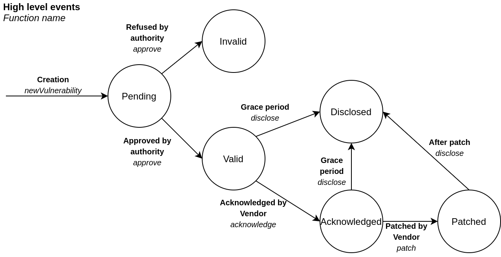
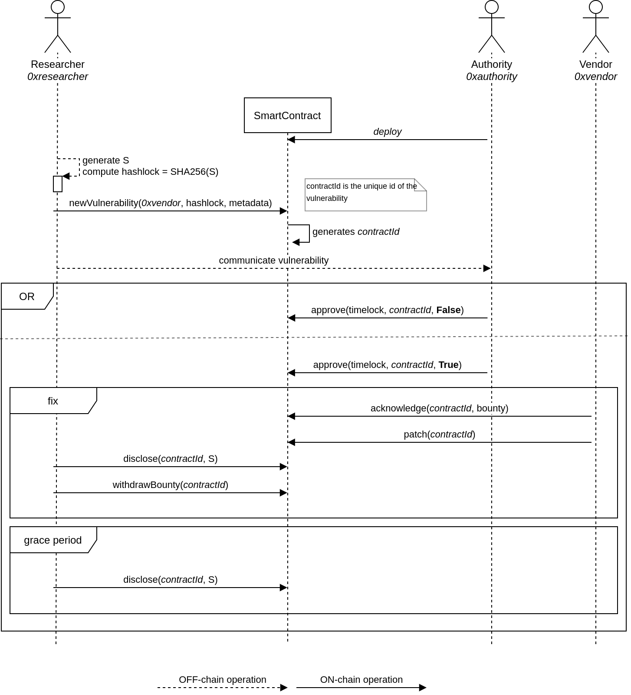

# Automated Responsible Disclosure implementation

## * Smart contract development branch *

*****

The smart contract VulnerabilityRegistry stores records of IT security vulnerabilities. A state machine identifies the state of progress of a particular vulnerability, from its creation to its resolution. This provides a transparent, immutable and decentralized support to the responsible disclosure process.

The actors in our scenario are:
- The Researcher, who discovers and stores a new vulnerability record
- The Authority, who accepts, or refuses, a vulnerability record
- The Vendor, the organization suffering of the vulnerability

## The states of a vulnerability

Each circle represents the State of a single vulnerability. For each transition, in **bold** is shown the high level event, in *italic* the corresponding smart contract function.
The Authority deploys the smart contract. A Researcher uploads an entry consisting of  {vendorAddress, hashlock, metadata}, and the contract creates a new vulnerability record . A vulnerability is approved (or not) by the Authority, which sets the timelock. The Vendor may acknowledge and provide a patch for the vulnerability within the timelock. The condition to disclose a vulnerability V is the following:
- (V.State == Valid OR Acknowledged) AND V.Timelock.Expired
- OR
- V.State == Patched

The current smart contract also stores a reward for the researcher that can be collected by them at any moment after the vulnerability has been disclosed (V.State == Disclosed). The reward amount is set and funded by the Vendor at acknowledgeVulnerability.

## The flow of the smart contract functions

In the figure below shows the sequence of calls of the smart contract functions. The boxes (frames) represent the cases that we can have:
- The Authority creates (deploy) the smart contract
- The Researcher produces the secret and creates a new vulnerability entry
- The Authority does not approve the vulnerability
- The Authority approves the vulnerability
- The Researcher discloses the vulnerability revealing the secret after two conditions:
    - The Vendor accepts and provides a patch
    - The grace period expires (shown the case only before acknowledgement)

## TODO

- [ ] Currently, the bounty is set by the Vendor and the amount stored in this smart contract.
Manage the bounty by a second smart contract deployed by the Vendor
- [ ] Is the bounty amount arbitrarly chosent by the Vendor, or they need to set an amount proportional to the severity chosen by the Authority?
- [ ] Decide whether the patch data needs to be stored, or the patch data is included in the vulnerability data at the end of the process
- [ ] Decide the structure of the vulnerability metadata
- [ ] The disclosure of the vulnerability requires 1 or 2 transactions?
    - 1 Tx: as soon the smart contract goes to the Disclosed state it needs to receive as input the location of the vulnerability data. This means the location is known in advance
    - 2 Txs: a first transaction is used to disclose the secret and set the smart contract in the Disclosed state. With a second transaction the IL component stores into the smart contract the location of the vulnerability data. This means the smart contract requires the Ethereum address of IL, and an additional state
- [ ] Write the tests for the smart contract
