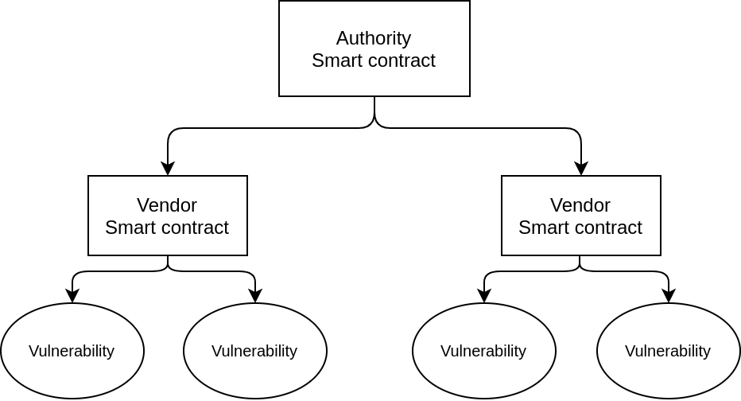
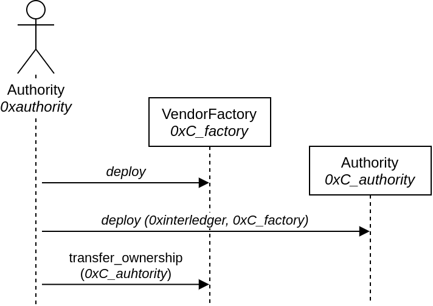
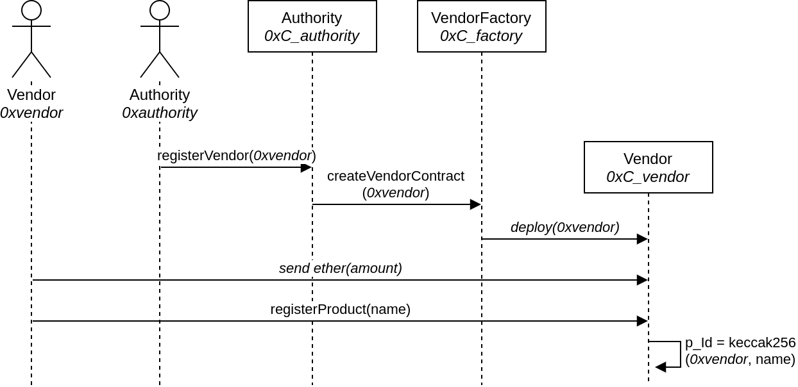
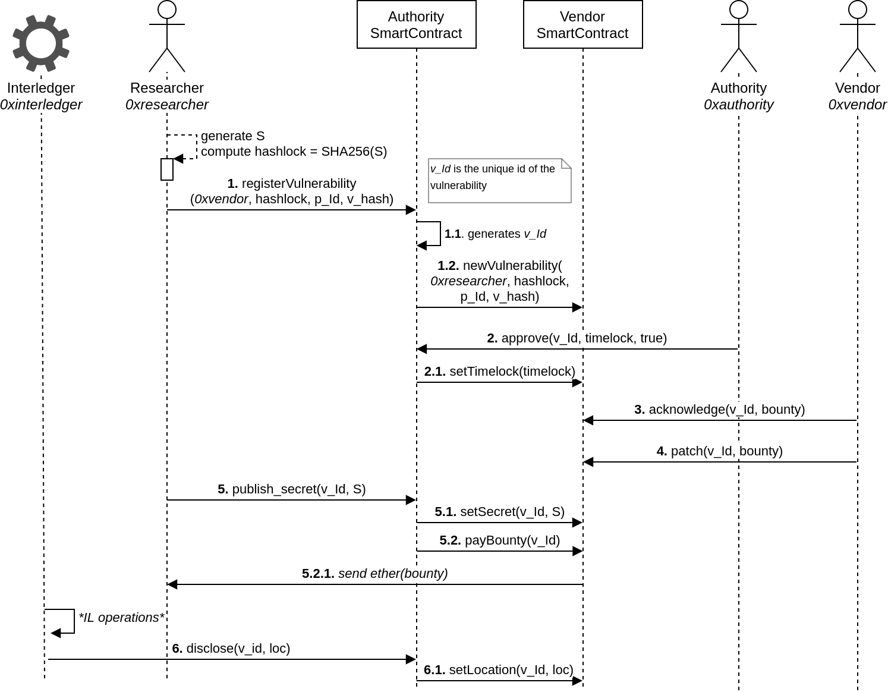

# Automated Responsible Disclosure implementation

## * Smart contract development branch *

*****

The smart contract VulnerabilityRegistry stores records of IT security vulnerabilities. A state machine identifies the state of progress of a particular vulnerability, from its creation to its resolution. This provides a transparent, immutable and decentralized support to the responsible disclosure process.

The actors in our scenario are:
- The Expert, who discovers and stores a new vulnerability record
- The Authority, who accepts, or refuses, a vulnerability record
- The Vendor, the organization suffering of the vulnerability

## The states of a vulnerability

Each circle represents the State of a single vulnerability. For each transition, in **bold** is shown the high level event, in *italic* the corresponding smart contract function.
The Authority deploys the smart contract. An Expert uploads a bundle consisting of {vendorAddres, productId, hashlock, vulnerabilityHash}, and the contract creates a new vulnerability record. A vulnerability is approved (or not) by the Authority, which sets the timelock. The Vendor may acknowledge and provide a patch for the vulnerability within the timelock. The condition to disclose a vulnerability V is the following:

- (V.State == Valid AND V.AckTimelock.Expired)
- OR
- (V.State == Acknowledged AND V.Timelock.Expired)
- OR
- (V.State == Patched)

The disclosure consists of two phases: publishing the secret (Disclosable), and fully disclose the vulnerability data (Disclosed). The current smart contract also stores a reward for the Expert that can be collected by them at any moment after the secret  has been published (V.State == Disclosed). The reward amount is set by the Vendor at acknowledgeVulnerability.

## Structure of the folders

During the development phase we are evaluating different architectures of smart contracts. Both the **contracts/** and **test/** folders keep a sub-folder for each proposed architecture. Currently we have:
- *singleContract/*: In this design the system is composed by a single smart contract keeping a reference to each vulnerability. A vulnerability is a *struct*;
- *contractPerVulnerability/*: In this design the system is composed by a factory contract creating a smart contract for each vulnerability. A smart contract for a Vendor is also provided to manage the bounties;
- *contractPerVendor/*: In this design we have a factory contract creating a smart contract for each Vendor. Each Vendor contract manages the bouties and stores, as *structs*, the vulnerability records opened to that particular Vendor. The Authority owns two contracts: the VendorFactory, a factory of VendorContracts, and the AuthorityContract for the ARD process. The factory is needed to avoid a bytecode too large for the AuhtorityContract.

## The flow of the smart contract functions

**The flow reflects the contractPerVendor version, the "official" one**

In the figures below shows the sequence of calls of the smart contract functions. An UML "Actor" represents an Ethereum Externally Owned Account (EOA); a rectangle a smart contract.

The setup for the Authority requires the following steps:

The transfer_ownership activates the factory. Here we have a weird race condition where the VendorFactory needs to know the address of the AuhtorityContract (its owner), and the AuhtorityContract needs to know the address of the Factory (to call its factory method).

The setup for the Vendor requires the following steps:

The Vendor funds the contract for bounties, and registers its products.

The ARD flow is the following:

## TODO

- [X] Write the tests for the smart contract
- [X] Update contract's documentation
- [ ] Clean code

## Requirements

NodeJs, Truffle

Install openzeppelin contracts with
    
    npm install