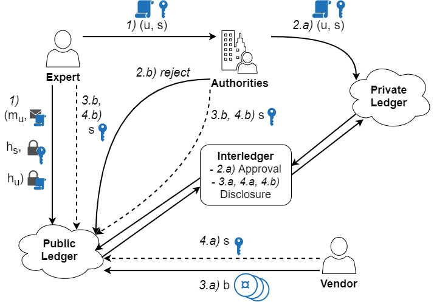
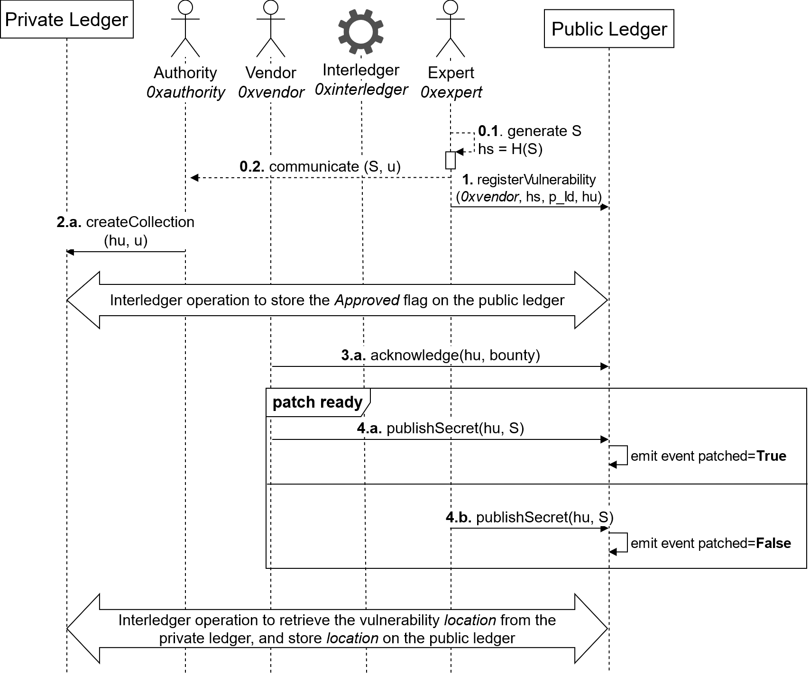

# Automated Responsible Disclosure of Security Vulnerabilities

## Table of Contents
- [Automated Responsible Disclosure of Security Vulnerabilities](#automated-responsible-disclosure-of-security-vulnerabilities)
  - [Table of Contents](#table-of-contents)
  - [Description](#description)
  - [Structure of the repository](#structure-of-the-repository)
  - [Protocol overview](#protocol-overview)
  - [Configuration](#configuration)
    - [Interledger](#interledger)
    - [Public ledger](#public-ledger)
    - [Private ledger](#private-ledger)
  - [License](#license)

## Description

This repository contains the code of the Automated Responsible Disclosure project (ARD).
In order to understand the protocol, you can read about the main concept: [Leveraging Interledger Technologies in IoT Security Risk Management](https://nowpublishers.com/article/Chapter/9781680836820?cId=978-1-68083-683-7.ch14), Lagutin et al.

A security Expert discovers a vulnerability *u* about a product developed by a Vendor. The vulnerability *u* has to be secret until the disclosure, but a subset of its metadata *mu* can be published as proof of existence. They generate a random secret *s*, compute the hashlock *hs = H(s)* and the fingreprint *hu = H(u)* with *H()* hash function.
- Step 1) The Expert stores on the public ledger the tuple *(mu, hs, hu)*, and sends the tuple *(u, s)* to a consortium of security Authorities;
- Step 2.a) If the Authorities approve the vulnerability, they store the received tuple in a private ledger shared with the involved vendor. The Interledger component automatically catches the event, and notifies on the public ledger the approval of *u*;
- Step 2.b) The vulnerability is not approved, the Authorities store the information on the public ledger;
- Step 3.a) The Vendor can acknowlege the vulnerability, and they can set a bounty *b* to reward the Expert. However, the Expert can receive the vulnerability only at the end, after the disclosure. The Vendor has a grace period in which they can provide a fix to the vulnerability;
- Step 3.b) If the Vendor does not acknowlege, either the Expert or the Authorities can disclose the vulnerability by publishing *s* on the public ledger. Interledger catches the event, retrieves the vulnerability *u* from the private ledger, and stores the vulnerability, or a location containing the vulnerability if *u* is large, on the public ledger, ending the disclosure;
- Step 4.a) If the Vendor manages to produce a fix before the grace period, they can disclose the vulnerability on the public ledger by publishing *s*. Moreover, the Expert receives the reward;
- Step 4.b) Same as step 3.b), but with the Expert receiving the reward.

## Structure of the repository

The root folder contains the code and data forked from the [SOFIE Interledger repository](https://github.com/SOFIE-project/Interledger).

The **ARD public ledger** folder contains the smart contracts, in Solidity for Ethereum, implementing the public ledger of ARD.

The **ARD-private-ledger** folder contains the chaincode, in typescript for Hyperledger Fabric, implementing the private ledger of ARD.

## Protocol overview

Assuming *0xvendor*, *0xauthority*, *0xexpert*, and *0xinterledger* Ethereum addresses of the actors, the figure below shows the flow of operations called to execute the protocol as described above.

The wide arrows are the interledger operations involved in the protocol. The figure below shows the interledger operations in detail, with example the disclosure of a vulnerability: 1) the communication from the public to the private ledger, and 2) the communcaition from the private to the public ledger.

## Configuration

### Interledger

    TODO

### Public ledger

The configuration and description of the smart contract is explained **ARD public ledger** README file.

### Private ledger

    TODO

## License

This component is licensed under the Apache License 2.0.
